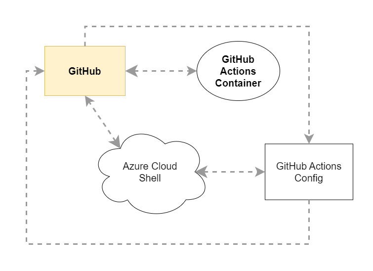
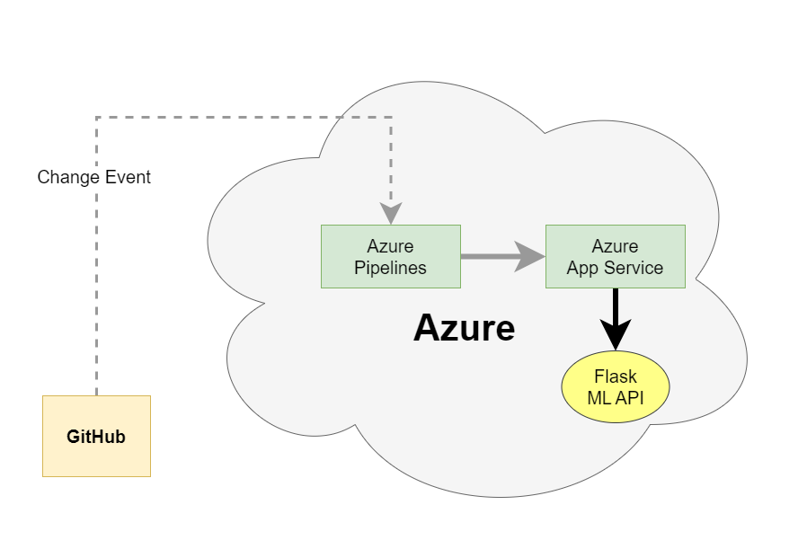

# Building a CI/CD Pipeline to Azure App Service
<p align="center">
  <a href="https://github.com/vuongvx96/nd082-Azure-Cloud-DevOps-Project-2/actions/workflows/python-app.yml">
    
  </a>
  <a href="https://dev.azure.com/XUANVUONG444/udacity-project-2/_build/latest?definitionId=6&branchName=main">
    
  </a>
</p>

## Introduction
In this project, you will build a Github repository from scratch and create a scaffolding that will assist you in performing both Continuos Integration and Continuous Delivery. You'll use Github Actions along with a Makefile, requirements.txt and application code to perform an initial lint, test, and install cycle. Next, you'll integrate this project with Azure Pipelines to enable Continuos Delivery to Azure App Service.

## Project Plan
* Link to Trello's board for the project - (https://trello.com/b/bWJdWUuV/ml-prediction-service)
* Link to a spreadsheet - (https://docs.google.com/spreadsheets/d/1Lzg_PK2LK9EHPgXwikktBw8eFCFvqUem5jsqod4dIow/edit?usp=sharing)

## Pre requisites

* An Azure Account (https://portal.azure.com/)
* A GitHub Account (http://github.com/)
* An Azure DevOps Account (https://dev.azure.com/)

## First: CI Pipeline with GitHub Actions

## Instructions

### Architectural Diagram - CI - GitHub Actions



### Instructions

* Enter to Azure Portal with your Account and open a Azure Cloud shell ( use Bash)

> If you are not created one , just follow the first creation and wait a seconds to get your Cloud Shell.

* First of all set up SSH Keys in your azure cloud shell, add the `id_rsa.pub` key to your GitHub repo ( ssh keys)  and then clone the project there.

```sh
ssh-keygen -t rsa -C "youremailaddress"
cat ~/.ssh/id_rsa.pub
```


* Project Scaffolding ( files):

| Plugin | README |
| ------ | ------ |
| Makefile | to create shortcuts to build, test, and deploy a project|
| requirements.txt| to list what packages a project needs |
| hello.py | a basic python app |
| test_hello.py | the test python file to above app|

Create a virtual environment for your application.

```sh
python3 -m venv ~/.myrepo
source ~/.myrepo/bin/activate
```

* Run `make all` which will install, lint, and test code

```sh
make all
```


* Next set up Github Actions in your repo doing this :

> just create new Github Actions new workflow (Python application template sample)


Note: it was  created a simple Github Actions in the branch  which automates the lint  and test of our app.
Note: You can add the GitHub Actions badge to you README.md ( it's a good practice to do that)

## Second : CI/CD Pipeline with AZURE DEVOPS

### Azure DevOps Pipelines Architectural Diagram



* Go to Azure Devops page  and sign in it, create a new Project inside your organization ( if you don't have an organization create one first).

* In your new Project in Azure DevOps, go to Project Settings and create a new `Project settings --> Pipelines --> Service connections` as is explained on the YouTube video link  below ( Service Connection must be of Type Azure Resource Manager)

> Note 1 : Name your Service Connection `AzureServiceConnection`
> Note 2: Use a link of as this `https://dev.azure.com/<organization>/<project_name>/_apis/serviceendpoint/endpoints?api-version=5.0-preview.2`  to find your ServiceConnectionID ( take note of this number since you will needed in the yaml file to build the pipeline). Replace the values for the ones that you created for your organization and project name.
Note3: the ServiceConnection ID is the number before the name `AzureServiceConnection` of the above link.

* Create the webapp deploying the code from the local workspace to Azure app Service ( using Plan B1)  with this command:

```sh
az webapp up -n <name of webapp> --resource-group <name of resouce group> --runtime "PYTHON|3.7" --location eastus --sku B1 --runtime 
```


>Note 1: Your service URL  will be something like this : `https://<name of webapp>.azurewebsites.net/`
>Note 2 : the name of your app must be unique!!!
>Note 3: This operation can take a while to complete ...

* In  your new Project in Azure DevOps, go to Pipelines --> New Pipeline --> GitHub --> Select Your Repo --> select `an Existing YAML file`


> Choose the `main` branch and the file named `azure-pipelines.yml` as is showed on the figure below
> Update the `azure-pipelines.yml` with the name of your webapp and your Service connection point ( Check YouTube video for a detailed explanation)
> Modifications are at variables webAppName & environmentName too !!!


* Choose Run Pipeline and your Azure DevOps Pipeline is going to start to be deployed with all his stages ( in this case 2: Build & deploy)


* Perform a cosmetic change to your app.py , so you can see your CI/CD pipelines in action on Azure DevOps ( CD) & GitHub Actions (CI)

> On file `app.py` change this line:

```sh
html = "<h3">Sklearn Prediction Home</h3>"
```

for this one:

```sh
html = "<h2>Sklearn Prediction Home APP - REST API</h2>"
```

and then perform a quick lint and push the changes to your repo:

```sh
make lint
git add .
git commit -m "app.py updated"
git push origin main
```


* Check that the webapp is running opening this URL, example:

```sh
https://mywebapp216240.azurewebsites.net/
```


* Update the file `make_predict_azure_app.sh` with the webapp service end point. Assign execute permission for this file

```sh
chmod +x make_predict_azure_app.sh
```

* When the Azure DevOps pipeline is successfully deployed, then its time to make a prediction on our webapp ( running in Azure App Service):

```sh
./make_predict_azure_app.sh
```

Answer:

```sh
Port: 443
{"prediction":[20.35373177134412]}
```


* Logging: Check on webapp log tail `az webapp log tail --name <app name> --resource-group <resource group name>` , the answer like this:


* Execute a Load Testing , running Locust .

> Note: Azure cloud Shell is not enough good to perform locust there, so use a VM or your own local machine ( windows, macos, linux) to run Locust
> Note: copy both files (`loadtesting.sh` & `locustfile.py`) and run the `loadtesting.sh` file and open the browser on `http://localhost:8089/` :

```sh
./loadtesting.sh
```

>from there you can see how the load testing is performing and how you app established on a # of RPS
> This is good to know how good is your webapp and your plan to manage the requests. So you can decide to scale up the plan service of your webapp for example.
-> Locust could generate a stats report.


Remaining screenshots can be checked in the screenshot folder.

## CLEANING OUT

* delete the resource group of your webapp created.

> At portal enter to your webapp service , locate the resource group.
> Go to that resource group and delete it.
> Wait for the notification of deletion .
> can close of the Azure portal

## Future Enhancements

* Adding more test cases.
* Creating a UI for making predictions.
* Using Github Actions instead of Azure pipelines.
* Run the app on Kubernetes cluster

## YouTube Demo

Link to YouTube Demo Video -> (https://youtu.be/fbfY22X4n24)

## License

MIT

**Free Software, Cool!**